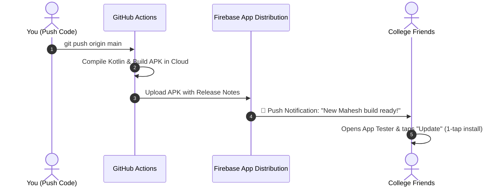

# 📱 THE DEFINITIVE ANDROID BUILD, TEST & ZERO-FRICTION DISTRIBUTION GUIDE
### How Production Teams Build, Live-Debug, and Distribute Android Apps Without Manual Hassle

---

## 1. The Core Problem & The Modern Solution

* **The Old Clunky Way (Slow & Painful):** Build APK $\rightarrow$ Send to WhatsApp/Google Drive $\rightarrow$ Download on phone $\rightarrow$ Allow unknown sources $\rightarrow$ Install manually $\rightarrow$ Repeat 50 times a day.
* **The Modern Startup Way (Zero-Friction & Fast):**
  1. **For You (Developer):** Wireless ADB pushes updates from PC directly to your phone in **under 3 seconds** over Wi-Fi.
  2. **For Your Friends (Beta Testers):** Push code to GitHub $\rightarrow$ GitHub Actions builds the APK $\rightarrow$ Friends get an automatic notification on their phones via **Firebase App Distribution** or a 1-tap QR Code download link.

---

## 2. The 3 Testing Rings of Mobile Development

```mermaid
flowchart TD
    subgraph Ring1 ["⚡ Ring 1: Instant Local Loop (You)"]
        R1A["Code changes in Kotlin"] --> R1B["Wireless ADB over Wi-Fi"]
        R1B --> R1C["Instantly running on your physical Android phone (< 3s)\nLogs stream live to PC terminal"]
    end

    subgraph Ring2 ["🧪 Ring 2: Headless & Logic Testing (PC Sandbox)"]
        R2A["Conversational State Engine"] --> R2B["Mock Android Framework Tests"]
        R2B --> R2C["Automated CLI Simulation & Web Testbed\nVerifies 100% of reasoning edge cases"]
    end

    subgraph Ring3 ["👥 Ring 3: College Friends Beta (Continuous Delivery)"]
        R3A["git push origin main"] --> R3B["GitHub Actions Cloud Builder"]
        R3B --> R3C["Firebase App Distribution / GitHub Releases"]
        R3C --> R3D["Friends receive 1-tap push update on their phones\nNo manual files, no WhatsApp sharing!"]
    end
```



---

## 3. Ring 1: Setting Up Wireless ADB (Zero-Cable Testing on Your Phone)

You don't need any USB cables once configured. Your phone will receive builds over Wi-Fi automatically.

### Step 1: Enable Developer Options on Your Android Phone
1. Open **Settings** $\rightarrow$ **About Phone**.
2. Tap **Build Number** 7 times until you see *"You are now a developer!"*.
3. Go to **Settings** $\rightarrow$ **System** $\rightarrow$ **Developer Options**.

### Step 2: Enable Wireless Debugging
1. In Developer Options, toggle **Wireless Debugging** to **ON** (make sure your phone and PC are on the same Wi-Fi).
2. Tap on **"Pair device with pairing code"**.
3. You will see an IP Address, Port, and a 6-digit code (e.g., `192.168.1.15:38421`, Code: `482910`).

### Step 3: Connect from PC Terminal (1-Time Pairing)
```powershell
# Pair with your phone
adb pair 192.168.1.15:38421 482910

# Connect to your phone
adb connect 192.168.1.15:40231

# Verify connection
adb devices
# Output: 192.168.1.15:40231    device
```

### Step 4: The 1-Click Fast Install Script (`deploy_local.ps1`)
Whenever you want to build and test:
```powershell
# Installs new build and launches the app instantly on your phone
./gradlew installDebug
adb shell am start -n com.heymahesh.agent/.MainActivity
```
*Your phone screen will instantly open the new version of the app!*

---

## 4. Live Debugging: Streaming Phone Logs to PC Terminal

You don't need to guess why something failed. Every log, error, wake-word trigger, and voice transcription will stream live to your PC:

```powershell
# Stream logs filtered exclusively to the "Hey Mahesh" agent
adb logcat -s "HeyMahesh" "VoiceAgent" "AccessibilityPilot"
```

---

## 5. Ring 3: Distributing to Friends via Firebase App Distribution



### Why Firebase App Distribution is the Industry Standard:
1. **No manual file transfers:** You never have to send APK files over WhatsApp or Telegram.
2. **Instant updates:** Friends get a notification the second you push a new feature.
3. **Crash reporting:** If an app crashes on your friend's phone, Firebase Crashlytics shows you the exact line of code that caused the crash in your dashboard.
4. **100% Free:** Free for unlimited testers and builds.

---

## 6. GitHub Actions Automated Build Workflow (`.github/workflows/build_and_release.yml`)

Every time we push code, GitHub builds the APK in the cloud for free:

```yaml
name: Build & Distribute Mahesh APK

on:
  push:
    branches: [ main ]

jobs:
  build:
    runs-on: ubuntu-latest
    steps:
      - uses: actions/checkout@v4
      - name: Set up JDK 17
        uses: actions/setup-java@v4
        with:
          java-version: '17'
          distribution: 'temurin'

      - name: Grant execute permission for gradlew
        run: chmod +x gradlew

      - name: Build Debug APK
        run: ./gradlew assembleDebug

      - name: Upload APK to GitHub Releases
        uses: softprops/action-gh-release@v1
        with:
          files: app/build/outputs/apk/debug/app-debug.apk
          tag_name: v${{ github.run_number }}
          name: "Mahesh v${{ github.run_number }}"
          body: "Automated build from commit ${{ github.sha }}"
        env:
          GITHUB_TOKEN: ${{ secrets.GITHUB_TOKEN }}
```

---

## 7. Fast Troubleshooting Matrix

| Issue | Cause | 1-Second Fix |
| :--- | :--- | :--- |
| **`adb devices` shows offline** | Wi-Fi IP changed or phone went to sleep | Toggle Wireless Debugging OFF and ON on phone, then `adb connect <IP>:<PORT>`. |
| **App crashes on startup on friend's phone** | Missing runtime permission or architecture mismatch | Check Firebase Crashlytics log or connect friend's phone via ADB to view `adb logcat`. |
| **Installation blocked by Play Protect** | Debug build not yet verified by Google Play | Tap *"More details"* $\rightarrow$ *"Install anyway"*. |
| **Accessibility service turns off automatically** | Phone battery saver killed background service | Add app to *"Battery Optimization: Unrestricted"* in phone settings. |

---
*Reference playbook saved for immediate use during development.*
